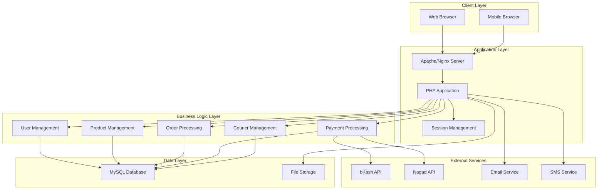
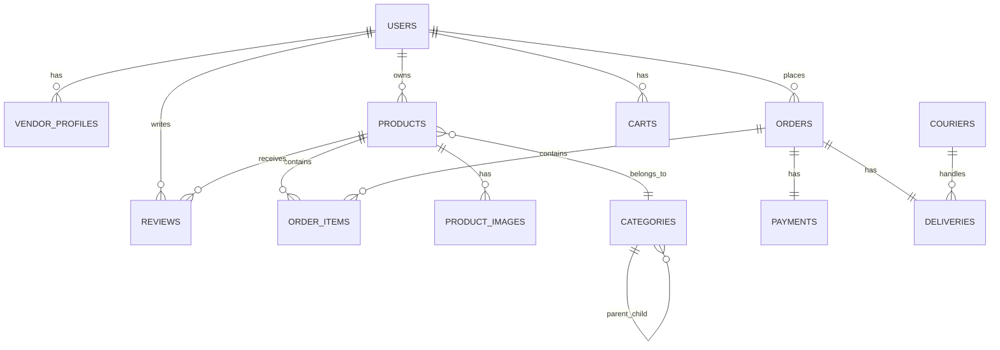

# Design Document

## Overview

The multivendor ecommerce platform is designed as a modular PHP application using object-oriented principles with procedural components where appropriate. The system follows MVC-like patterns with clear separation between data access, business logic, and presentation layers. The architecture supports horizontal scaling and integrates with local Bangladeshi payment gateways (bKash, Nagad) while maintaining PCI compliance standards.

## Architecture

### System Architecture



### Directory Structure

```
/multivendor-ecommerce/
├── config/
│   ├── database.php       # Database configuration
│   ├── app.php           # Application settings
│   └── payment.php       # Payment gateway configs
├── src/
│   ├── Models/           # Data models
│   ├── Controllers/      # Business logic controllers
│   ├── Services/         # Service layer classes
│   └── Helpers/          # Utility functions
├── public/
│   ├── index.php         # Front controller
│   ├── assets/           # CSS, JS, images
│   └── uploads/          # User uploaded files
├── templates/
│   ├── layouts/          # Base templates
│   ├── customer/         # Customer views
│   ├── vendor/           # Vendor views
│   └── admin/            # Admin views
├── database/
│   ├── migrations/       # Database schema files
│   └── seeds/            # Sample data
├── vendor/               # Composer dependencies
├── tests/                # Unit and integration tests
├── composer.json
└── .htaccess
```

## Components and Interfaces

### Core Components

#### 1. Authentication System
- **UserAuth Class**: Handles login, registration, password management
- **RoleManager Class**: Manages role-based access control
- **SessionHandler Class**: Secure session management with CSRF protection

#### 2. User Management
- **User Model**: Base user entity with common properties
- **Customer Model**: Extends User with customer-specific features
- **Vendor Model**: Extends User with store management capabilities
- **Admin Model**: Extends User with administrative functions

#### 3. Product Management
- **Product Model**: Core product entity with inventory tracking
- **Category Model**: Hierarchical category system
- **ProductImage Model**: Handles multiple product images
- **ProductSearch Service**: Advanced search and filtering

#### 4. Order Management
- **Order Model**: Main order entity
- **OrderItem Model**: Individual items within orders
- **Cart Service**: Shopping cart functionality
- **OrderProcessor Service**: Handles order lifecycle

#### 5. Payment System
- **PaymentGateway Interface**: Common interface for all payment methods
- **BkashGateway Class**: bKash API integration
- **NagadGateway Class**: Nagad API integration
- **CODPayment Class**: Cash on delivery handling
- **PaymentProcessor Service**: Orchestrates payment flow

#### 6. Courier Management
- **Courier Model**: Courier profile and information
- **Delivery Model**: Delivery assignment and tracking
- **CourierService Class**: Manages delivery logistics
- **DeliveryCalculator Class**: Calculates shipping costs

### Database Schema

```sql
-- Enhanced schema with payment and courier support

CREATE TABLE users (
    id INT PRIMARY KEY AUTO_INCREMENT,
    name VARCHAR(100) NOT NULL,
    email VARCHAR(150) UNIQUE NOT NULL,
    password VARCHAR(255) NOT NULL,
    phone VARCHAR(20),
    role ENUM('customer', 'vendor', 'admin') DEFAULT 'customer',
    email_verified BOOLEAN DEFAULT FALSE,
    status ENUM('active', 'inactive', 'suspended') DEFAULT 'active',
    created_at TIMESTAMP DEFAULT CURRENT_TIMESTAMP,
    updated_at TIMESTAMP DEFAULT CURRENT_TIMESTAMP ON UPDATE CURRENT_TIMESTAMP
);

CREATE TABLE vendor_profiles (
    id INT PRIMARY KEY AUTO_INCREMENT,
    user_id INT UNIQUE NOT NULL,
    store_name VARCHAR(100) NOT NULL,
    store_description TEXT,
    store_logo VARCHAR(255),
    store_banner VARCHAR(255),
    business_address TEXT,
    trade_license VARCHAR(100),
    nid_number VARCHAR(20),
    bank_account_name VARCHAR(100),
    bank_account_number VARCHAR(50),
    bank_name VARCHAR(100),
    verification_status ENUM('pending', 'verified', 'rejected') DEFAULT 'pending',
    commission_rate DECIMAL(5,2) DEFAULT 10.00,
    rating DECIMAL(3,2) DEFAULT 0.00,
    total_sales DECIMAL(12,2) DEFAULT 0.00,
    created_at TIMESTAMP DEFAULT CURRENT_TIMESTAMP,
    FOREIGN KEY (user_id) REFERENCES users(id) ON DELETE CASCADE
);

CREATE TABLE categories (
    id INT PRIMARY KEY AUTO_INCREMENT,
    name VARCHAR(100) NOT NULL,
    slug VARCHAR(100) UNIQUE NOT NULL,
    description TEXT,
    parent_id INT NULL,
    image VARCHAR(255),
    sort_order INT DEFAULT 0,
    status ENUM('active', 'inactive') DEFAULT 'active',
    FOREIGN KEY (parent_id) REFERENCES categories(id) ON DELETE SET NULL
);

CREATE TABLE products (
    id INT PRIMARY KEY AUTO_INCREMENT,
    vendor_id INT NOT NULL,
    category_id INT NOT NULL,
    name VARCHAR(255) NOT NULL,
    slug VARCHAR(255) UNIQUE NOT NULL,
    description TEXT,
    short_description VARCHAR(500),
    price DECIMAL(10,2) NOT NULL,
    compare_price DECIMAL(10,2),
    cost_price DECIMAL(10,2),
    sku VARCHAR(100) UNIQUE,
    stock_quantity INT DEFAULT 0,
    min_stock_level INT DEFAULT 5,
    weight DECIMAL(8,2),
    dimensions VARCHAR(100),
    status ENUM('active', 'inactive', 'draft') DEFAULT 'draft',
    featured BOOLEAN DEFAULT FALSE,
    meta_title VARCHAR(255),
    meta_description TEXT,
    rating DECIMAL(3,2) DEFAULT 0.00,
    review_count INT DEFAULT 0,
    view_count INT DEFAULT 0,
    created_at TIMESTAMP DEFAULT CURRENT_TIMESTAMP,
    updated_at TIMESTAMP DEFAULT CURRENT_TIMESTAMP ON UPDATE CURRENT_TIMESTAMP,
    FOREIGN KEY (vendor_id) REFERENCES users(id) ON DELETE CASCADE,
    FOREIGN KEY (category_id) REFERENCES categories(id),
    INDEX idx_vendor_status (vendor_id, status),
    INDEX idx_category_status (category_id, status),
    INDEX idx_featured (featured, status)
);

CREATE TABLE product_images (
    id INT PRIMARY KEY AUTO_INCREMENT,
    product_id INT NOT NULL,
    image_path VARCHAR(255) NOT NULL,
    alt_text VARCHAR(255),
    sort_order INT DEFAULT 0,
    is_primary BOOLEAN DEFAULT FALSE,
    FOREIGN KEY (product_id) REFERENCES products(id) ON DELETE CASCADE
);

CREATE TABLE carts (
    id INT PRIMARY KEY AUTO_INCREMENT,
    customer_id INT NOT NULL,
    product_id INT NOT NULL,
    quantity INT NOT NULL DEFAULT 1,
    created_at TIMESTAMP DEFAULT CURRENT_TIMESTAMP,
    updated_at TIMESTAMP DEFAULT CURRENT_TIMESTAMP ON UPDATE CURRENT_TIMESTAMP,
    FOREIGN KEY (customer_id) REFERENCES users(id) ON DELETE CASCADE,
    FOREIGN KEY (product_id) REFERENCES products(id) ON DELETE CASCADE,
    UNIQUE KEY unique_cart_item (customer_id, product_id)
);

CREATE TABLE orders (
    id INT PRIMARY KEY AUTO_INCREMENT,
    order_number VARCHAR(50) UNIQUE NOT NULL,
    customer_id INT NOT NULL,
    subtotal DECIMAL(10,2) NOT NULL,
    shipping_cost DECIMAL(10,2) DEFAULT 0.00,
    tax_amount DECIMAL(10,2) DEFAULT 0.00,
    discount_amount DECIMAL(10,2) DEFAULT 0.00,
    total_amount DECIMAL(10,2) NOT NULL,
    currency VARCHAR(3) DEFAULT 'BDT',
    payment_method ENUM('bkash', 'nagad', 'cod') NOT NULL,
    payment_status ENUM('pending', 'paid', 'failed', 'refunded') DEFAULT 'pending',
    order_status ENUM('pending', 'confirmed', 'processing', 'shipped', 'delivered', 'cancelled', 'returned') DEFAULT 'pending',
    shipping_address JSON NOT NULL,
    billing_address JSON,
    notes TEXT,
    created_at TIMESTAMP DEFAULT CURRENT_TIMESTAMP,
    updated_at TIMESTAMP DEFAULT CURRENT_TIMESTAMP ON UPDATE CURRENT_TIMESTAMP,
    FOREIGN KEY (customer_id) REFERENCES users(id),
    INDEX idx_customer_status (customer_id, order_status),
    INDEX idx_payment_status (payment_status),
    INDEX idx_order_date (created_at)
);

CREATE TABLE order_items (
    id INT PRIMARY KEY AUTO_INCREMENT,
    order_id INT NOT NULL,
    product_id INT NOT NULL,
    vendor_id INT NOT NULL,
    product_name VARCHAR(255) NOT NULL,
    product_sku VARCHAR(100),
    quantity INT NOT NULL,
    unit_price DECIMAL(10,2) NOT NULL,
    total_price DECIMAL(10,2) NOT NULL,
    vendor_status ENUM('pending', 'confirmed', 'processing', 'shipped', 'delivered', 'cancelled') DEFAULT 'pending',
    FOREIGN KEY (order_id) REFERENCES orders(id) ON DELETE CASCADE,
    FOREIGN KEY (product_id) REFERENCES products(id),
    FOREIGN KEY (vendor_id) REFERENCES users(id)
);

CREATE TABLE payments (
    id INT PRIMARY KEY AUTO_INCREMENT,
    order_id INT NOT NULL,
    payment_method ENUM('bkash', 'nagad', 'cod') NOT NULL,
    transaction_id VARCHAR(100),
    gateway_transaction_id VARCHAR(100),
    amount DECIMAL(10,2) NOT NULL,
    currency VARCHAR(3) DEFAULT 'BDT',
    status ENUM('pending', 'processing', 'completed', 'failed', 'cancelled', 'refunded') DEFAULT 'pending',
    gateway_response JSON,
    processed_at TIMESTAMP NULL,
    created_at TIMESTAMP DEFAULT CURRENT_TIMESTAMP,
    FOREIGN KEY (order_id) REFERENCES orders(id) ON DELETE CASCADE,
    INDEX idx_transaction (transaction_id),
    INDEX idx_gateway_transaction (gateway_transaction_id)
);

CREATE TABLE couriers (
    id INT PRIMARY KEY AUTO_INCREMENT,
    name VARCHAR(100) NOT NULL,
    phone VARCHAR(20) NOT NULL,
    email VARCHAR(150),
    vehicle_type ENUM('bike', 'car', 'van', 'truck') NOT NULL,
    vehicle_number VARCHAR(50),
    coverage_areas JSON,
    status ENUM('active', 'inactive', 'busy') DEFAULT 'active',
    rating DECIMAL(3,2) DEFAULT 0.00,
    total_deliveries INT DEFAULT 0,
    created_at TIMESTAMP DEFAULT CURRENT_TIMESTAMP
);

CREATE TABLE deliveries (
    id INT PRIMARY KEY AUTO_INCREMENT,
    order_id INT NOT NULL,
    courier_id INT,
    pickup_address JSON NOT NULL,
    delivery_address JSON NOT NULL,
    estimated_delivery TIMESTAMP,
    actual_pickup TIMESTAMP NULL,
    actual_delivery TIMESTAMP NULL,
    delivery_cost DECIMAL(8,2) NOT NULL,
    status ENUM('assigned', 'picked_up', 'in_transit', 'delivered', 'failed', 'returned') DEFAULT 'assigned',
    tracking_number VARCHAR(50) UNIQUE,
    notes TEXT,
    created_at TIMESTAMP DEFAULT CURRENT_TIMESTAMP,
    updated_at TIMESTAMP DEFAULT CURRENT_TIMESTAMP ON UPDATE CURRENT_TIMESTAMP,
    FOREIGN KEY (order_id) REFERENCES orders(id) ON DELETE CASCADE,
    FOREIGN KEY (courier_id) REFERENCES couriers(id) ON DELETE SET NULL
);

CREATE TABLE reviews (
    id INT PRIMARY KEY AUTO_INCREMENT,
    product_id INT NOT NULL,
    customer_id INT NOT NULL,
    order_item_id INT NOT NULL,
    rating TINYINT CHECK (rating BETWEEN 1 AND 5),
    title VARCHAR(255),
    comment TEXT,
    verified_purchase BOOLEAN DEFAULT TRUE,
    helpful_count INT DEFAULT 0,
    status ENUM('pending', 'approved', 'rejected') DEFAULT 'pending',
    created_at TIMESTAMP DEFAULT CURRENT_TIMESTAMP,
    FOREIGN KEY (product_id) REFERENCES products(id) ON DELETE CASCADE,
    FOREIGN KEY (customer_id) REFERENCES users(id) ON DELETE CASCADE,
    FOREIGN KEY (order_item_id) REFERENCES order_items(id) ON DELETE CASCADE,
    UNIQUE KEY unique_review (customer_id, order_item_id)
);

CREATE TABLE notifications (
    id INT PRIMARY KEY AUTO_INCREMENT,
    user_id INT NOT NULL,
    type ENUM('order', 'payment', 'delivery', 'review', 'system') NOT NULL,
    title VARCHAR(255) NOT NULL,
    message TEXT NOT NULL,
    data JSON,
    read_at TIMESTAMP NULL,
    created_at TIMESTAMP DEFAULT CURRENT_TIMESTAMP,
    FOREIGN KEY (user_id) REFERENCES users(id) ON DELETE CASCADE,
    INDEX idx_user_unread (user_id, read_at)
);

CREATE TABLE system_settings (
    id INT PRIMARY KEY AUTO_INCREMENT,
    setting_key VARCHAR(100) UNIQUE NOT NULL,
    setting_value TEXT,
    setting_type ENUM('string', 'number', 'boolean', 'json') DEFAULT 'string',
    description TEXT,
    updated_at TIMESTAMP DEFAULT CURRENT_TIMESTAMP ON UPDATE CURRENT_TIMESTAMP
);
```

## Data Models

### Key Model Relationships



### Model Specifications

#### User Model
- Handles authentication and basic user information
- Supports role-based access control
- Includes email verification and account status management

#### Product Model
- Comprehensive product information with SEO support
- Inventory tracking with low stock alerts
- Multi-image support with primary image designation
- Rating and review aggregation

#### Order Model
- Multi-vendor order support with individual item tracking
- Comprehensive address storage using JSON fields
- Payment and shipping cost calculations
- Status tracking at both order and item levels

#### Payment Model
- Support for multiple payment gateways
- Transaction tracking with gateway response storage
- Refund and cancellation support

#### Courier Model
- Internal courier management system
- Coverage area definition using JSON
- Performance tracking with ratings and delivery counts

Now I'll use the prework tool to analyze the acceptance criteria before writing the correctness properties:
## Correctness Properties

*A property is a characteristic or behavior that should hold true across all valid executions of a system-essentially, a formal statement about what the system should do. Properties serve as the bridge between human-readable specifications and machine-verifiable correctness guarantees.*

### Property Reflection

After analyzing all acceptance criteria, several properties can be consolidated to eliminate redundancy:

- Authentication properties (1.1, 1.2, 1.3) can be combined into comprehensive authentication testing
- Payment gateway properties (6.1, 6.2) follow the same pattern and can be tested with a unified approach
- Notification properties (11.1, 11.2, 11.3, 11.4) share common notification delivery patterns
- File upload properties (2.3, 3.2) can be consolidated into general file handling
- Data persistence properties (2.2, 3.1, 3.3) follow similar patterns for CRUD operations

### Core Properties

**Property 1: User Authentication Integrity**
*For any* user credentials (valid or invalid), the authentication system should correctly validate credentials, create appropriate sessions for valid users, reject invalid attempts with proper error messages, and redirect authenticated users to role-appropriate dashboards.
**Validates: Requirements 1.1, 1.2, 1.3, 1.4, 1.5**

**Property 2: Multi-vendor Order Separation**
*For any* shopping cart containing items from multiple vendors, the checkout process should create separate order records for each vendor while maintaining the customer's single payment transaction.
**Validates: Requirements 5.5, 7.1**

**Property 3: Inventory Consistency**
*For any* product with defined stock levels, the system should prevent purchases when stock is insufficient, immediately reflect stock changes when updates occur, and maintain accurate inventory counts across all operations.
**Validates: Requirements 3.4, 3.5, 5.4**

**Property 4: Payment Gateway Integration**
*For any* supported payment method (bKash, Nagad, COD), the payment processing should handle the transaction according to the method's requirements, confirm successful payments, and properly handle failures with appropriate error messages.
**Validates: Requirements 6.1, 6.2, 6.3, 6.4, 6.5**

**Property 5: Search and Filter Accuracy**
*For any* search query or filter combination, the system should return only products that match the specified criteria, include all required display information (images, prices, vendor details), and properly paginate large result sets.
**Validates: Requirements 4.2, 4.3, 4.4, 4.5**

**Property 6: Cart Operations Consistency**
*For any* cart modification (add, update, remove), the system should immediately update quantities and totals, maintain cart state across sessions, and accurately calculate shipping costs based on vendor locations.
**Validates: Requirements 5.1, 5.2, 5.3**

**Property 7: Order Status Tracking**
*For any* order status change, the system should update the status correctly, maintain the status history, notify relevant parties (customers, vendors), and enable appropriate next actions based on the new status.
**Validates: Requirements 7.2, 7.3, 7.5**

**Property 8: Review System Integrity**
*For any* completed purchase, the system should enable review functionality, accept ratings within the valid range (1-5), prevent duplicate reviews from the same customer, and correctly aggregate ratings for products and vendors.
**Validates: Requirements 10.1, 10.2, 10.3, 10.4, 10.5**

**Property 9: Courier Management Workflow**
*For any* delivery assignment, the system should track courier assignments, calculate delivery charges based on distance and weight, update delivery status appropriately, and generate accurate delivery reports.
**Validates: Requirements 8.1, 8.2, 8.3, 8.4, 8.5**

**Property 10: Notification Delivery**
*For any* system event that triggers notifications, the appropriate notification should be sent through the correct channel (email, SMS, in-app) to the relevant users based on their roles and preferences.
**Validates: Requirements 11.1, 11.2, 11.3, 11.4, 11.5**

**Property 11: Data Security and Validation**
*For any* sensitive data input or file upload, the system should properly encrypt sensitive information, validate file types and content, implement CSRF protection on forms, and maintain audit logs for critical operations.
**Validates: Requirements 12.1, 12.3, 12.4, 12.5**

**Property 12: Vendor Management Workflow**
*For any* vendor registration or profile update, the system should create proper store profiles, handle file uploads securely, maintain verification status, and enable appropriate functionality based on verification state.
**Validates: Requirements 2.1, 2.2, 2.3, 2.4, 2.5**

**Property 13: Product Management Operations**
*For any* product creation or modification, the system should store all required information, handle image uploads with proper processing, organize products within the category hierarchy, and maintain product visibility based on status.
**Validates: Requirements 3.1, 3.2, 3.3, 4.1**

**Property 14: Admin Control Functions**
*For any* administrative operation, the system should provide accurate dashboard metrics, enable vendor approval workflows, support category and settings management, provide dispute resolution tools, and generate accurate financial reports.
**Validates: Requirements 9.1, 9.2, 9.3, 9.4, 9.5**

**Property 15: Customer Order Experience**
*For any* customer order, the system should provide complete order history access, accurate tracking information, and enable post-delivery actions like reviews when appropriate.
**Validates: Requirements 7.4**

## Error Handling

### Error Categories

#### 1. Validation Errors
- **Input Validation**: Invalid email formats, weak passwords, missing required fields
- **Business Rule Violations**: Insufficient stock, invalid price ranges, duplicate SKUs
- **File Upload Errors**: Invalid file types, oversized files, corrupted uploads

#### 2. Payment Errors
- **Gateway Failures**: API timeouts, invalid responses, network connectivity issues
- **Transaction Errors**: Insufficient funds, declined cards, expired payment methods
- **Security Violations**: Invalid signatures, tampered requests, suspicious activities

#### 3. System Errors
- **Database Errors**: Connection failures, constraint violations, deadlocks
- **External Service Failures**: Email service downtime, SMS gateway issues
- **Resource Limitations**: Disk space, memory limits, concurrent user limits

#### 4. Security Errors
- **Authentication Failures**: Invalid credentials, expired sessions, brute force attempts
- **Authorization Violations**: Insufficient permissions, role escalation attempts
- **Data Integrity Issues**: CSRF attacks, SQL injection attempts, XSS attempts

### Error Handling Strategies

#### User-Facing Errors
- Display user-friendly error messages without exposing system details
- Provide actionable guidance for error resolution
- Maintain form data when possible to prevent user frustration
- Log detailed error information for debugging while showing generic messages to users

#### Payment Error Recovery
- Implement retry mechanisms for transient gateway failures
- Provide alternative payment methods when primary method fails
- Maintain order state during payment processing to prevent data loss
- Send confirmation emails for successful payments and failure notifications

#### System Error Recovery
- Implement database transaction rollbacks for data consistency
- Use circuit breaker patterns for external service calls
- Provide graceful degradation when non-critical services fail
- Implement automatic retry with exponential backoff for recoverable errors

## Testing Strategy

### Dual Testing Approach

The testing strategy employs both unit testing and property-based testing to ensure comprehensive coverage:

**Unit Tests**: Focus on specific examples, edge cases, and error conditions
- Test specific user registration scenarios with known data
- Verify payment gateway responses with mock data
- Test file upload validation with specific file types
- Validate form submissions with known input combinations

**Property Tests**: Verify universal properties across all inputs
- Test authentication with randomly generated valid and invalid credentials
- Verify cart calculations with random product combinations and quantities
- Test search functionality with random queries and filter combinations
- Validate order processing with random multi-vendor cart scenarios

### Property-Based Testing Configuration

**Testing Framework**: PHPUnit with Eris (PHP property-based testing library)
- Minimum 100 iterations per property test
- Each property test references its design document property
- Tag format: **Feature: multivendor-ecommerce, Property {number}: {property_text}**

**Test Data Generation**:
- **User Data**: Random names, emails, phone numbers, addresses
- **Product Data**: Random names, descriptions, prices, stock quantities
- **Order Data**: Random product combinations, quantities, shipping addresses
- **Payment Data**: Random transaction amounts, payment methods

**Property Test Examples**:

```php
/**
 * Feature: multivendor-ecommerce, Property 1: User Authentication Integrity
 * @test
 */
public function testUserAuthenticationIntegrity()
{
    $this->forAll(
        Generator\elements(['valid', 'invalid']),
        Generator\string(),
        Generator\string()
    )->then(function ($credentialType, $email, $password) {
        // Test authentication logic with generated credentials
        // Verify appropriate responses for valid/invalid combinations
    });
}

/**
 * Feature: multivendor-ecommerce, Property 3: Inventory Consistency
 * @test
 */
public function testInventoryConsistency()
{
    $this->forAll(
        Generator\choose(0, 1000), // stock quantity
        Generator\choose(1, 10)    // purchase quantity
    )->then(function ($stock, $purchaseQty) {
        // Test inventory operations maintain consistency
        // Verify stock levels are accurate after operations
    });
}
```

### Integration Testing

**End-to-End Scenarios**:
- Complete customer journey from registration to order delivery
- Vendor onboarding and product management workflow
- Payment processing through all supported gateways
- Multi-vendor order fulfillment and tracking

**API Testing**:
- Payment gateway integration testing with sandbox environments
- Email and SMS service integration validation
- File upload and image processing workflows

### Performance Testing

**Load Testing Scenarios**:
- Concurrent user registration and authentication
- High-volume product searches and filtering
- Multiple simultaneous checkout processes
- Payment gateway stress testing

**Database Performance**:
- Query optimization for product searches
- Index effectiveness for order lookups
- Transaction performance under load

### Security Testing

**Vulnerability Assessment**:
- SQL injection prevention testing
- XSS attack prevention validation
- CSRF protection verification
- File upload security testing

**Authentication Security**:
- Brute force attack prevention
- Session management security
- Password strength enforcement
- Role-based access control validation

This comprehensive testing strategy ensures that the multivendor ecommerce platform maintains high quality, security, and performance standards while providing reliable functionality for all user roles.